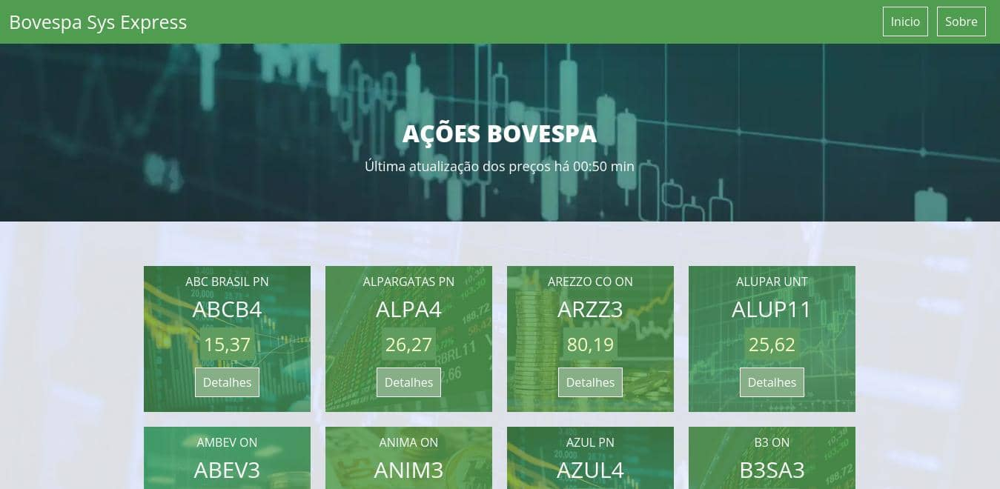

# Bovespa Sys Express

Exemplo de um sistema que faz uso da técnica de Data Scraping para obtenção de dados das ações da Bovespa.

Construído em Node.js seguindo o padrão MVC.

## FUNCIONAMENTO DO SISTEMA
Os sistema exibe na tela as informações das ações salvas no banco de dados.

A cada 15 minutos, o sistema busca e salva no banco de dados os preços atualizados das ações - através do site 'valorinveste.globo.com/cotacoes/'.

Ao clicar na botão de detalhes de cada ação, o sistema apresenta os seus dados detalhados, que são obtidos em tempo real através do site 'www.fundamentus.com.br'.

## TECNOLOGIAS E FERRAMENTAS UTILIZADAS

<strong>Node.js</strong>: implementação do Back-end

<strong>Express</strong>: framework web para Node.js

<strong>Handlebars</strong>: template engine para gerar páginas dinâmicas do Front-end

<strong>MySQL</strong>: SGBD para armazenar as informações de preço das ações

<strong>Sequelize</strong>: ORM para simplificar a conexão com o banco de dados MySQL

<strong>Node-cron</strong>: biblioteca utilizada para agendar a tarefa de atualização dos preços das ações

<strong>Axios</strong>: biblioteca utilizada para fazer requests HTTP no Back-end

<strong>Cheerio</strong>: biblioteca utilizada para fazer Data Scraping das informações no Back-end

Clique <a href="https://bovespa-sys-express.herokuapp.com/" target="_blank">aqui</a> para acessar o sistema.

